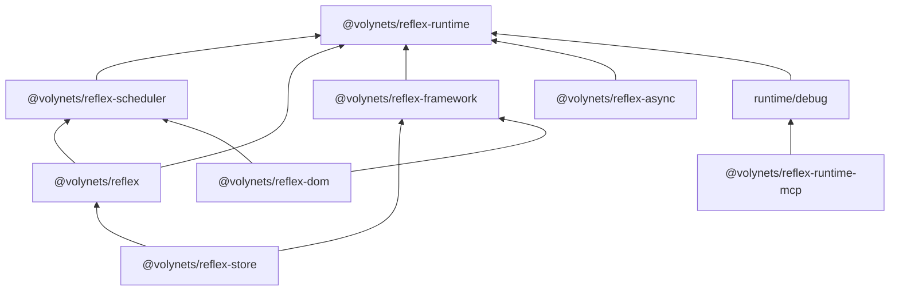

# Reflex architecture

This document describes the maintained packages and their production boundaries. The previous architecture description is retained as [historical evidence](docs/architecture/history/f572742.md); its old `@reflex/core` and `@reflex/runtime` directories are not current workspace packages.

## Layers

The kernel owns reactive execution, dependency graph invariants and runtime contexts. Scheduling remains host-controlled. Framework owns lifecycle trees and host-independent renderable meaning; DOM owns browser materialization, events, props, ranges and hydration.

Store uses a Store-specific compiler target built on Framework lifecycle ownership. Its synchronous untracked actions, cancellation, rollback and disposal do not depend on model shape validation. Models may own stores; they are not a prerequisite for store compilation.

Async composes the synchronous kernel. Attempt identity, validation, commit authority, pending state and stale settlement belong to the async layer. Async operations do not redefine ordinary synchronous producer reads.

## Identity and contexts

A compatible library composition resolves one kernel module graph within a realm, selected format and consistent development conditions. Runtime public/internal entrypoints are built together and share chunks. Multiple RuntimeContext instances are execution contexts within that graph; they do not imply duplicate kernel modules.

Production ESM, development ESM, production CJS and development CJS are qualified independently. Diagnostics use the development graph. When public APIs and diagnostics are composed, load them under `--conditions=development`; the default production root and the development debug entrypoint must not be assumed to share state.

Simultaneous `require` and `import` can create separate kernel graphs. Cross-format reactive state sharing needs a separate contract.

## DOM library and standalone

DOM library imports compatible Runtime, Scheduler and Framework packages. Its JSX entrypoints retain Framework identity. Store, Async and DOM must compose through the shared kernel and lifecycle boundaries.

`@volynets/reflex-dom/standalone` contains its own kernel, scheduler and framework. Standalone root and JSX subpaths share that closed graph. It remains intentionally independent from library package state. Both JavaScript and declaration closure are verified.

SSR runs in Node without DOM globals. Hydration in the browser must preserve existing compatible nodes, attach reactive updates and release owned resources on disposal.

## Diagnostics and MCP

The kernel remains independent from protocol schemas, event history and diagnostic registries. The only core-to-debug bridge is the existing no-op hook bridge. Debug registries must not strongly retain reactive nodes.

Diagnostics are read-only. SDK and transport concerns belong to the MCP adapter. See the [runtime architecture contract](packages/reflex-runtime/docs/architecture-contract.md) and [local runtime rules](packages/reflex-runtime/AGENTS.md).

## Tooling and lifecycle separation

- Package `build` scripts own their local phases and outputs.
- pnpm supplies the workspace dependency closure and ordering.
- `tooling/configs` supplies flags, aliases, explicit test projects and quality coverage.
- `tooling/build` supplies declarations, safe cleaning, orchestration and archive verification.
- `tooling/testing` qualifies actual archives in an external consumer without source aliases.
- `tooling/benchmarks` supplies protocol, schema, comparisons and cohort-aware history.
- `experiments` documents immutable curated research evidence.

Default product commands exclude private research. Shared configuration changes must preserve resolved flags, aliases, conditions, plugins and test discovery; approved differences are recorded by the parity checker.

## Validation

Required CI launches for every pull request and merge queue event. Its final aggregate checks explicit required IDs, complete reports and log hashes; unexpected skips are failures.

Package qualification verifies real archive contents, all exported paths and declarations, format identity, Store/Async/DOM composition, SSR/hydration, standalone isolation and MCP transport. Historical differential cohorts remain intact. The separate active-divergence gate prevents a successful diagnostic replay of a known error from becoming a release pass.

Performance comparisons require comparable workload, protocol, environment and observable work. Small replicate campaigns are marked screening evidence. Confidence statements require independent process replication; historical protocols form separate cohorts.
