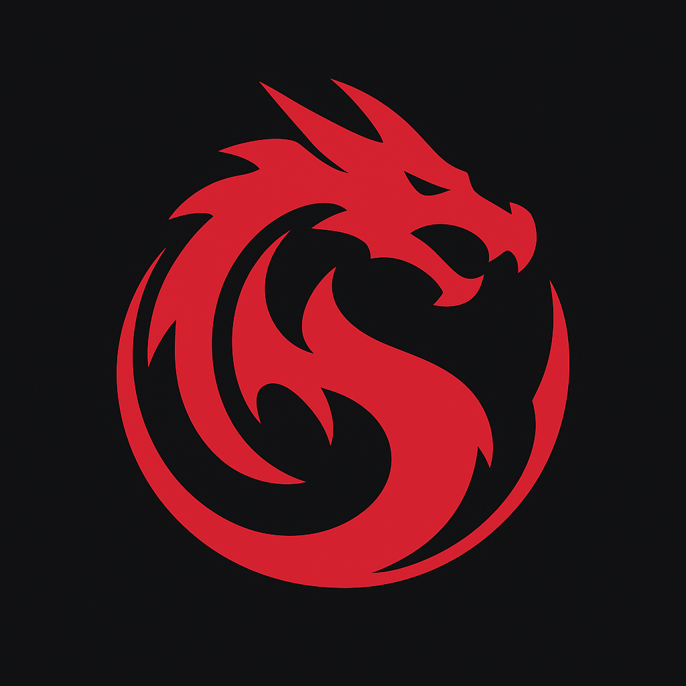

<p align="center">
  
</p>

<h1 align="center">Reflex</h1>

<p align="center">
  <em>Universal Reactive Runtime</em>
</p>

<p align="center">
  <strong>“Reactivity beyond the DOM — one core, any surface.”</strong>
</p>

---

## 🚀 Overview


Reflex is not just another UI framework.
It is a **general-purpose reactive runtime**: a lightweight ownership system, fine-grained signals, and a scheduler — independent of JSX or the DOM.

Unlike React, Solid, or Vue, Reflex is not locked to the browser. You can render into **DOM, Canvas, WebGL, mobile bridges, or custom targets** — the runtime stays the same. UI is just one of many possible frontends.

**Core idea:** One **Owner** per scope governs signals, effects, and components. Lifecycle, dependency tracking, and cleanup all go through it — no leaks, no zombie state.

---

## ✨ Key Advantages

- **Ownership as the Unit of Life**
  Every signal, effect, or component belongs to an owner. Dispose of a scope → everything inside cleans up automatically.

- **Contextual Dependency Injection**
  Context flows naturally down the ownership tree via prototype inheritance. No prop drilling, no manual context management.

- **Fine-Grained Signals**
  Reactive primitives (`signal`, `derived`, `effect`) update only what actually changes. No re-rendering unnecessary nodes.

- **Coarse Transactions & Batching**
  Batched updates, snapshots, and async-safe consistency for SSR, hydration, and streaming pipelines.

- **Universal Surfaces**
  DOM, Canvas, WebGL, server pipelines, native UI — the runtime is agnostic.

- **Scheduler-Orchestrated Side Effects**
  Timers, I/O, DOM patches, or workers run through a unified priority-based queue for smooth interactivity.

- **Lightweight & Fast**
  Core size ~6 KB. Predictable scaling from micro widgets to massive app trees.

---

## 🧩 Architectural Layers

1. **Ownership Layer (Coarse)**

   - Scopes, parent/child hierarchy, disposals.
   - Lifecycle backbone: mount, unmount, cleanup.

2. **Reactive Layer (Fine)**

   - Signals, computed values, DAG dependency graph.
   - Minimal updates only where needed.

3. **Orchestration Layer**

   - Unified scheduler for effects, timers, I/O, and batching.
   - Priorities, deadlines, cancellations.

4. **Surface Layer (Optional)**

   - DOM, Canvas, WebGL, mobile, or custom renderers.

---

## 🔍 Ownership Flow

**Owner Tree Example:**

```
App Owner (macro)
├─ Main Owner
│  ├─ Signal A → Memo 1 → Effect 1
│  └─ Signal B → Memo 2 → Effect 2
└─ Footer Owner
   └─ Effect 3
```

_Signals mark DAG nodes dirty, scheduler flushes only affected computations._
_Dispose is iterative post-order: children first, then parent._

**Dirty propagation:**

```
Signal A.set(99)
    ↓ markDirty
Memo1 → dirty=true
Effect1 → scheduled run
Memo2 → unchanged
```

---

## 🔍 Reflex vs Existing Frameworks

| Capability     | React / Solid             | Reflex                                    |
| -------------- | ------------------------- | ----------------------------------------- |
| **Core Model** | Component-centric         | Ownership-centric (scopes as first-class) |
| **Reactivity** | Hooks / signals (UI only) | Signals for any domain, not tied to UI    |
| **Lifecycle**  | Hooks / cleanup           | Hierarchical ownership + dispose batch    |
| **Context**    | Context API               | Prototype inheritance per scope           |
| **Rendering**  | DOM-bound                 | DOM, Canvas, WebGL, native, server        |
| **Scheduling** | Fiber (UI only)           | General-purpose priority-based scheduler  |
| **Philosophy** | UI framework              | Universal reactive runtime                |

---

## 📦 Getting Started

**Install:**

```bash
npm install @reflex/core
```

**Basic Signal Example:**

```ts
import { signal, derived, effect } from "@reflex/core";

const count = signal(0);
const doubled = derived(() => count.value * 2);

effect(() => {
  console.log(`Count=${count.value}, Double=${doubled.value}`);
});

count.value++; // logs instantly
```

**DOM Example (optional surface binding):**

```tsx
import { signal, render } from "@reflex/core/dom";

function Counter() {
  const count = signal(0);

  return <button onClick={() => count.value++}>Count: {count.value}</button>;
}

render(<Counter />, document.getElementById("app"));
```

---

## 🧠 Why Reflex?

A **reflex** is an immediate response to a stimulus.
Reflex delivers **instant, precise state propagation**, independent of UI layers, with lifecycle and scheduling baked in.

**Owner mantra:**

> _"Owner knows its children, marks dirty, and batch-cleans everything."_

---

## ⚡ Internal API Highlights

| User API            | Internal Owner API                      | Description                      |
| ------------------- | --------------------------------------- | -------------------------------- |
| `useState(initial)` | `createSignal(initial)`                 | Fine-grained reactive value      |
| `useEffect(fn)`     | `createEffect(() => fn(), autoCleanup)` | Auto-tracked, runs on dirty      |
| `useMemo(fn)`       | `createMemo(fn)`                        | Computed, lazy, dependency-aware |
| `useContext(MyCtx)` | `owner._context?.MyCtx`                 | Prototype-inherited context      |
| `onMount(fn)`       | `_onScopeMount(fn)`                     | Called after scope creation      |
| `onUnmount(fn)`     | `_onCleanup(fn)`                        | Cleanup on dispose               |

**Lifecycle Flow:**

```
createScope(App)
    ↓ currentOwner = App
    createSignal(A)
        ↓ _owner = App
        A.set(val)
            ↓ DAG runs
    dispose App
        ↓ iterative batch cleanup
```

---

## 📚 Resources

- Documentation (coming soon): [reflex.dev/docs](https://reflex.dev/docs)
- GitHub: [github.com/reflex-ui/core](https://github.com/reflex-ui/core)
- Community: [X](https://x.com/reflex_ui) • Discord

---

## 🏁 License

MIT License © 2025 Andrii Volynets
