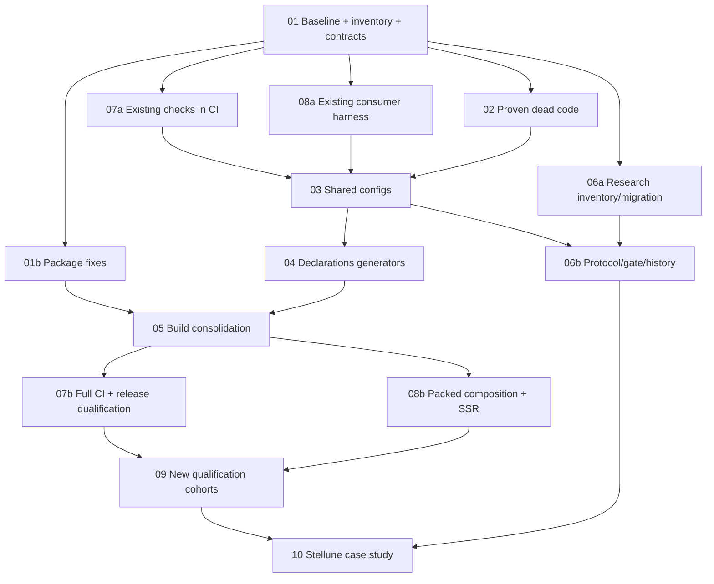

# Детальный план реорганизации Reflex: premain-refactor

> Execution scope update: the production foundation is implemented and locally validated. See [production-implementation.md](production-implementation.md) and [production-validation.json](production-validation.json). This file retains the original specification. At the user’s request, Stellune and new late-stage research/holdout expansion are excluded. Existing semantic cohorts and research evidence are preserved. See the development quickstart and implementation report for the executed scope.

Дата аудита: 8 октября 2026 года. Ветка: `premain-refactor`. Исходный коммит: `f572742fc0cdcc8291fa0af53736af5e92472def`.

Документ развивает приложенный план в техническую спецификацию и проверяет его предпосылки по текущему репозиторию. Выполнены статический аудит и ограниченный npm pack dry-run существующего dist. Lint, typecheck, чистые сборки, тесты, установка tarballs и performance qualification в рамках этой проработки не запускались. Упоминания результатов старых исследований означают сведения из сохранённых отчётов, а не новый успешный прогон.

Факты аудита сохранены рядом в [premain-refactor-audit.json](./premain-refactor-audit.json). Это снимок структуры и конфигурации, а не execution baseline.

## 1. Цель и границы работы

Результат реорганизации — воспроизводимая разработка, проверка и публикация экосистемы Reflex при сохранении публичного API, семантики выполнения и измеряемой стоимости работы.

Три жизненных цикла должны получить явные правила:

| Жизненный цикл | Основные входы | Результат | Проверка |
| --- | --- | --- | --- |
| Разработка продукта | Код пакетов, compiler transforms, unit/integration tests | Совместимые модули и поведение приложения | PR CI, архитектурные и семантические контракты |
| Исследования | Зафиксированная гипотеза, workload, instrumentation, overlay | Воспроизводимые данные и вывод | Протокол эксперимента, provenance, correctness oracle |
| Публикация | Версионированный исходник, lockfile, release plan | Проверенные tarballs и release notes | Consumer installation без source aliases, release qualification |

В этой работе не менять алгоритмы hot path, политику scheduler, async publication semantics, Store compiler semantics и renderer behavior. Обнаруженные семантические дефекты оформлять самостоятельными исправлениями с контрпримером и отдельным сравнением производительности.

Перемещение файла считается выполненным только после обновления исполняемых ссылок, документированных команд, путей ввода/вывода, CI и provenance. Уменьшение числа строк или каталогов не является критерием успеха.

## 2. Подтверждённое состояние и поправки к исходному плану

### 2.1. Масштаб и версии

| Наблюдение | Результат |
| --- | --- |
| Файлы в `git ls-files` | 1 092 |
| Файлы непосредственно в `scripts/` | 16 |
| Файлы в `bench-results/` | 139, суммарно 1 993 022 байта |
| Tracked-файлы в `packages/reflex-runtime/perf/` | 36, суммарно 5 263 384 байта |
| Пакеты непосредственно в `packages/` | 9, включая `reflex-runtime-mcp` |
| Tracked workspace members по текущим globs, без корня | 12 |
| Node, наблюдавшийся в среде / `.nvmrc` | `v25.2.0` |
| Менеджер пакетов в корневом manifest | `pnpm@9.0.0` |
| Установленные Vitest / Vite / TypeScript | `4.1.5 / 6.4.2 / 5.9.3` |
| Установленные Rollup / Changesets CLI / jsdom | `4.60.3 / 2.31.0 / 29.1.1` |

Не смешивать диапазоны в `package.json`, resolved versions lockfile и содержимое уже установленного `node_modules`. Execution baseline обязан проверять согласованность этих трёх источников.

Есть локальные файлы, отсутствующие в tree коммита: `packages/reflex-store/bench/README.md` и `packages/reflex-store/bench/results/`. Они не являются кандидатами на удаление. `drafts/` содержит 238 файлов на диске и 0 tracked-файлов; часть `lab/` также локальная и игнорируемая. Чистый checkout — обязательная база инвентаризации.

### 2.2. Что требует реального изменения

1. Корневой `build` уже равен `pnpm -r build`. Проблема находится в пакетных фазах, вложенных пересборках и параллельном существовании ручной цепочки.
2. `scripts/build-chain.mjs` описывает только Runtime, Scheduler, Reflex и Async. Он проверяет порядок переданного списка, но не достраивает полный граф зависимостей.
3. В `outputsExist` проверяется `stat.isDirectory()` для каждого output, хотя у Async output включает `dist/index.d.ts`. Кэш Async не может сработать корректно.
4. `cleanPackage` использует Windows-префикс с обратным слешем; эквивалентная очистка на POSIX не обеспечена.
5. Runtime в ручной цепочке получает `globals.d.ts`, а штатный `build:ts` генерирует `index.d.ts`. Ручная сборка также обходит `check:projection-erasure` и `check:identity`.
6. `reflex/prebuild:ts` повторно собирает зависимости. `reflex-dom/build:dependencies` делает то же для Runtime, Scheduler и Framework. Замена root-команды оставит эти пересборки.
7. CI охватывает четыре пакета. Framework, DOM, Store, Runtime MCP и Vite plugin не имеют полной обязательной проверки в текущем workflow.
8. Runtime `check:architecture` и `test:projection` не покрыты текущим CI. `check:rules` проверяет другую ответственность.
9. Полезные artifact/identity checks уже существуют. Их нужно объединить в общий qualification, сохранив доказанные проверки.
10. Старая holdout cohort показывала 4/6 уничтоженных мутаций; последующий recovery corpus описывает 6/6. Новая задача — подтвердить актуальные результаты и создать новую независимую cohort, а не объявлять старые survivors текущим дефектом.
11. Benchmark CI уже использует отдельные checkout, metadata, схему gate и порядок B1/H1/H2/B2. Его надо развивать и перенести, сохранив протокол.
12. `ARCHITECTURE.md` и `Readme.md` ссылаются на отсутствующие `packages/@reflex/core` и `packages/@reflex/runtime`. В архитектуре есть устаревшая ссылка на `packages/reflex/lab/async-semantics`; фактический эксперимент расположен в `packages/reflex-async/lab/async-semantics`.
13. Не все `private: false` пакеты обязательно предназначены для публикации. У Devtools отсутствуют build/exports/files, у MCP нужен отдельный CLI contract, у algorithm-projection — явный статус исследовательской зависимости.
14. `plugins/@eslint/eslint-plugin-forbidden-imports` присутствует в Git, но не включён workspace globs и содержит peer `eslint:^8` при корневом ESLint 9. Это кандидат на отдельное решение после проверки использования.

### 2.3. Ограниченная проверка упаковки

У @volynets/reflex подтверждён пропуск export target: ./debug.import → ./dist/dev/debug/index.js. Файл существует на диске, но отсутствует в npm pack-list, поскольку files не включает dist/dev. Остальные 15 строковых conditional targets присутствуют.

Probe: npm 11.6.2, Node v25.2.0, Windows; npm pack --dry-run --ignore-scripts --json с cache в разрешённой временной директории. Получено 36 файлов, unpackedSize 177 937, packed size 40 457 байт. Настоящий tarball не создан, provenance существующего dist не установлен. Это достаточное основание для раннего packaging PR, но не завершённый clean release qualification.

Исправление должно включить dev-entry и транзитивные shared chunks, затем проверить реальный publication path. Нельзя добавить только один файл без проверки его относительных imports.

### 2.4. Приоритеты

P0: execution baseline, package contracts, обязательные проверки, чистая сборка, flags/aliases, package identity, release qualification.

P1: разделение research tooling и временных результатов, усиление статистики и истории, новая holdout cohort, Stellune case study.

P2: косметическое выравнивание структуры, массовое переименование каталогов тестов, унификация уже корректных локальных удобств.

## 3. Контракты, которые нельзя потерять

| Контракт | Что сохранять | Чем доказывать |
| --- | --- | --- |
| Reactive execution | Наблюдаемые значения, порядок допустимых эффектов, tracking/cleanup/recovery | Семантический oracle, regression corpus, production artifact tests |
| Kernel identity | Общие public/internal runtime chunks в одном формате и наборе conditions | Импорт обоих entrypoints из установленных tarballs, наблюдаемая совместимость состояния |
| Runtime contexts | Несколько контекстов выполнения могут использовать один kernel module | Interleaving, teardown, isolation и отсутствие глобального context leak |
| ESM/CJS | Каждый поддержанный формат имеет корректные exports и declarations | Отдельные consumer fixtures для import и require |
| Mixed ESM/CJS | Не обещать общий singleton до доказательства отдельного bridge | Отдельный fixture и явно опубликованное решение о поддержке |
| DOM library | Runtime, Framework и Scheduler остаются внешними совместимыми пакетами | Анализ bundle imports и packed DOM/Store composition |
| DOM standalone | Закрытый граф runtime/framework/scheduler; JSX subpaths принадлежат ему | Проверка JS/types closure и независимости от library runtime |
| Store | Lifetime основан на Framework LifecycleScope; action batching остаётся синхронным и untracked | Compiler output tests, disposal/rollback, packed integration |
| Async | Attempt identity, commit authority, stale writes, cancellation не меняют sync kernel semantics | Observable async oracle, production suite, race/cancellation сценарии |
| Diagnostics/MCP | Core не получает protocol/registry/history/Zod allocation в hot path | Runtime architecture check и production erasure check |
| Research evidence | Сохраняются исходный workload, hashes, отрицательные выводы и методика | Manifest + checksum + воспроизведение эталонного исследования |

Runtime rules берутся из `packages/reflex-runtime/AGENTS.md` и `packages/reflex-runtime/docs/architecture-contract.md`. Допустимая граница core→debug — no-op bridge `debug/debug.runtime.ts`; diagnostics остаются read-only, registries не удерживают reactive nodes сильными ссылками.

Для каждого публичного пакета создать контракт с полями: name/version/status, поддержанные environments и formats, exports conditions и их порядок, declarations, peers, build inputs/outputs, lifecycle hooks, sideEffects, forbidden bundled dependencies, qualification commands, release policy. Снимок экспортов сравнивать с baseline по смыслу; изменения путей generated-файлов могут быть допустимы при неизменном внешнем contract.

## 4. Целевая структура и правила переноса

```text
Reflex/
├── packages/
│   ├── reflex-runtime/       # kernel, diagnostics, contracts
│   ├── reflex-scheduler/
│   ├── reflex/
│   ├── reflex-framework/
│   ├── reflex-dom/
│   ├── reflex-store/
│   ├── reflex-async/
│   ├── reflex-runtime-mcp/   # CLI/protocol adapter, отдельный contract
│   └── reflex-devtools/      # продукт/приложение: статус зафиксировать
├── plugins/
│   └── @vite/reflex-vite-plugin/
├── third-party/
│   └── algorithm-projection/
├── tooling/
│   ├── configs/
│   ├── build/
│   ├── testing/
│   │   ├── contracts/
│   │   ├── consumers/
│   │   └── integration/
│   └── benchmarks/
│       ├── harness/
│       ├── comparison/
│       └── quality-gate/
├── experiments/              # самостоятельные исследования
├── examples/                 # только действительно общие приложения
├── docs/
│   ├── architecture/
│   ├── contracts/
│   └── development/
└── .github/workflows/
```

Это модель ответственности. Не создавать пустые каталоги и не переносить всё одновременно.

- Пакетные тесты, bench и compiler fixtures оставлять рядом с пакетом. `test/` и `tests/` не выравнивать без отдельной пользы.
- Независимые исследования переносить в `experiments/` только после описания запуска, provenance и входов.
- `lab/reactivity-bench` оставить private workspace либо перевести в `experiments/reactivity-bench` с обновлением workspace membership и lockfile отдельным PR.
- `third-party/algorithm-projection` оставить на месте до решения о статусе пакета; runtime projection contract не превращать в обычную production dependency.
- Локальные ignored `drafts/` и `lab/` не входят в массовый tracked cleanup.
- В root сохранить wrappers для привычных команд; перенос их реализации не должен требовать запоминания нового набора команд.
- Пакетные `rollup.config.ts` и `vite.config.ts` оставить тонкими локальными overrides. Корень предоставляет presets и project registry.
- Общий `tsconfig.base.json` не должен смешивать bundler resolution с потребительским NodeNext. Consumer fixtures имеют отдельные settings.

## 5. Этап baseline: данные до первого удаления

### 5.1. Два слоя baseline

**Структурный снимок**: tree SHA, tracked paths, manifests, workspace membership, exports, dependency edges, script references, config modes. Его первоначальная версия есть в audit JSON.

**Execution baseline**: реальные исходы команд, test discovery, tarball contents, identity, размеры и измерения. Он пока не выполнен и является результатом PR-01.

Собирать execution baseline в чистой временной копии исходного SHA. Не очищать текущий пользовательский checkout. Working tree changes и ignored assets не должны случайно попасть в результаты.

### 5.2. Последовательность запуска

1. Записать SHA, OS/architecture, Node/pnpm/npm, CPU, available memory, timezone и runner identifier.
2. Установить pinned pnpm 9.0.0; выполнить `pnpm install --frozen-lockfile`. Lockfile не должен измениться.
3. Получить действительный список workspace members; сверить его с явным package registry.
4. Запустить текущие lint/typecheck/test/build по отдельным пакетам с сохранением stdout, stderr, exit code и timeout. Одна ошибка не отменяет сбор остальных результатов.
5. Отдельно выполнить dev/projection/architecture/e2e/consumer проверки, которые не входят в default scripts.
6. Сформировать tarballs существующим проверенным pack-путём; записать поведение hooks и содержимое архивов.
7. Установить tarballs вне monorepo, без aliases и inherited dependencies; выполнить consumer checks.
8. Зафиксировать package sizes: unpacked bytes, JS по formats, declarations, gzip/brotli с pinned compression settings.
9. Запустить выбранный performance protocol на одной машине и одном Node; сохранить raw measurements и manifest.
10. Повторить подозрительные/нестабильные результаты и описать known deviations.

Ни root `pnpm -r test`, ни `--if-present` не доказывают полноту. Отсутствующий обязательный script — отдельный coverage gap, а не молчаливый pass.

### 5.3. Минимальная матрица существующих команд

Команды ниже существуют сейчас; это перечень для baseline, не утверждение об их успешном выполнении.

| Пакет | Основной baseline | Дополнительные команды |
| --- | --- | --- |
| Runtime | `lint`, `typecheck`, `test`, `build` | `test:dev`, `test:projection`, `check:architecture`, `check:rules`, `test:e2e` |
| Scheduler | `lint`, `typecheck`, `test`, `build` | выбранные scheduler integration benches |
| Reflex | `lint`, `typecheck`, `test`, `build` | `typecheck:tests`, `demo:build`, `demo:typecheck` |
| Framework | `lint`, `typecheck`, `test`, `build` | `test` уже включает `test:dev`; не считать два запуска новой coverage |
| DOM | `lint`, `typecheck`, `test`, `build` | `test:browser`, `test:standalone`, `test:library` |
| Store | `lint`, `typecheck`, `test`, `build` | `test:dev`, `test:differential`, `test:integration`, `test:packed-runtime` |
| Async | `lint`, `typecheck`, `test`, `build` | `test:async:package`, `typecheck:package`, production/semantics/mutations suites |
| Runtime MCP | `typecheck`, `build`, `smoke` | CLI/stdio и protocol qualification; отсутствующий lint/test оформить явно |
| Devtools | `dev` | нет обязательной build/typecheck/test матрицы: решить app status и добавить checks |
| Vite plugin | `typecheck`, `build` | integration fixture с transform; отсутствие unit suite не скрывать |
| Algorithm projection | `typecheck`, `test`, `build` | erasure/instrumentation contract с runtime |
| Reactivity lab | `typecheck`, `test`, `build`, `contracts` | research-only, smoke reproduction |

Исследовательские checks запускать отдельно от release eligibility. Для технически непубликуемых пакетов статус должен быть объявлен явно.

### 5.4. Предлагаемый execution schema

```json
{
  "schemaVersion": 1,
  "kind": "execution-baseline",
  "commit": "<full SHA>",
  "dirty": false,
  "lockfileSha256": "<hash>",
  "environment": {
    "node": "<exact>",
    "pnpm": "9.0.0",
    "os": "<name/version>",
    "arch": "<architecture>"
  },
  "checks": [{
    "id": "runtime.test.dev",
    "command": "pnpm --filter @volynets/reflex-runtime test:dev",
    "status": "passed|failed|skipped|timed_out|not_run",
    "exitCode": null,
    "durationMs": null,
    "logPath": "<relative artifact path>",
    "logSha256": "<hash>",
    "deviationId": null
  }],
  "packages": [],
  "performanceRuns": [],
  "knownDeviations": []
}
```

Не добавлять значения `passed` по старому отчёту. Для deviation нужны check/test identifier, воспроизводитель, первая наблюдавшаяся версия, причина, ответственная роль, ссылка на задачу и условие снятия исключения. Широкое разрешение «все ошибки пакета известны» недопустимо.

Для тестов записывать список файлов, projects, conditions, число discovered/executed/skipped. Сравнение только числа зелёных тестов может скрыть потерю целой suite.

### 5.5. Критерий завершения baseline

У каждой обязательной проверки есть результат или объяснённый coverage gap; для ошибок есть воспроизводитель. Tarball manifests и performance metadata сохранены. Повторный запуск на том же исходнике различает детерминированные отклонения и flakes. До этого нельзя объявлять cleanup безопасным.

## 6. Инвентаризация и dead-code audit

### 6.1. Единица решения

Для каждого tracked-файла или однородной группы фиксировать роль, потребителей, входы/выходы, lifecycle, owner role, основание решения и проверку. Отдельно учитывать package exports, bin, package hooks, конфиг discovery, CI, документацию с командами и динамические загрузки.

| Категория | Значение | Допустимое действие |
| --- | --- | --- |
| Active | Участвует в поддерживаемой разработке, продукте или исследовании | Оставить, при необходимости перенести |
| Duplicated | Доказана эквивалентная ответственность | Объединить после equivalence check |
| Historical | Есть provenance и значение для истории исследования | Curated archive с manifest |
| Generated | Есть генератор и воспроизводимый вход | Исключить из Git, если не утверждён golden fixture |
| Unreferenced | Потребителей не обнаружено после полного аудита entrypoints | Удалить с evidence и regression check |
| Unknown | Роль не установлена | Сохранить; назначить вопрос и ответственную роль |

Реалистичный gate — отсутствие удаления Unknown и отсутствие Unknown в release-critical цепочке. Требование «назначение всех 1 092 файлов установлено до любой работы» может задержать полезные изменения; исследовательские Unknown допускаются с явным backlog и изоляцией от production.

Knip применять как источник кандидатов. В monorepo `entry/project` корня задаются в workspace `"."`; публичные exports не оценивать только по внутренним импортам. Настроить скрипты, bin, plugins и dynamically loaded fixtures. Не добавлять каждый файл в `entry`: это скрывает unused exports. Generated boundaries задавать `project` patterns. Установку Knip и изменение lockfile выполнить отдельным контролируемым изменением. ([Knip workspaces](https://knip.dev/features/monorepos-and-workspaces), [границы анализа](https://knip.dev/guides/configuring-project-files))

### 6.2. Кандидаты и необходимые доказательства

| Кандидат | Наблюдение | Перед решением |
| --- | --- | --- |
| `packages/@reflex/*` glob | Нет таких tracked-пакетов | Сверить clean workspace list, удалить glob и проверить frozen install |
| `config/vite.config.ts` | Template `@reflex/core / my-lib.*`; literal references не найдены | Проверить CLI/config discovery и документацию, удалить отдельным маленьким PR |
| `config/vitest.config.ts` | Shared-looking файл без обнаруженных literal consumers | Проверить фактическое discovery; заменить осознанным preset либо удалить |
| `config/prettier.config.mjs` | Отдельный путь не доказывает auto-discovery | Проверить `prettier --find-config-path` на поддерживаемом файле; решить подключение |
| Два d.ts генератора | Почти одинаковая логика, разные output names | Сравнить expected output, modules и declaration closure |
| `build-chain.mjs` | Отдельный частичный граф, кэш и divergent phases | Сначала guards и phase equivalence; затем решить удаление или минимизацию |
| `plugins/@eslint/*` | Вне workspace, старый peer ESLint | Проверить imports/configs/политику использования; удалить или поддержать явно |
| Экспериментальные JSON | Большие curated/raw данные | Сначала manifest, checksum и reproduce; размер не служит доказательством бесполезности |

Удаление из активного tree не уменьшает прошлую Git history. Переписывание history не входит в этот план.

### 6.3. Все 16 корневых скриптов

| Скрипт | Роль и потребитель | Вход → выход | Предлагаемое место |
| --- | --- | --- | --- |
| `benchmark-history.ts` | Benchmark workflow и `bench:history` | Gate reports → history/trend | `tooling/benchmarks/quality-gate/` |
| `benchmark-quality-gate.ts` | Benchmark workflow и `bench:quality-gate` | Paired results + thresholds → verdict/report | `tooling/benchmarks/quality-gate/` |
| `build-chain.mjs` | `reflex/build:all`, `async/build:all` | Ordered package names + sources → package outputs/cache | После phase audit удалить либо минимизировать |
| `check-stages-semantics.mjs` | `qualify-stages` и stages README | Snapshots + scenarios → semantic traces/report | Пакетный stages harness либо shared comparison |
| `collect-benchmark-results.ts` | `bench:runtime:json` в корне | Vitest raw data → normalized result | `tooling/benchmarks/harness/` |
| `compare-benchmark-results.ts` | `bench:compare` | Baseline/current results → comparison | `tooling/benchmarks/comparison/` |
| `compare-stages.mjs` | `qualify-stages` и stages README | Stage snapshots + workload → timing/structural report | `tooling/benchmarks/comparison/` |
| `compare-tracking-graph.mjs` | Ручная documented команда tracking README | Tracking graph variants → comparison | Пока пакетное исследование; перенести с protocol |
| `compare-tracking-tiers-factorial.mjs` | `bench:tracking-factorial` | Variant bundles + factorial workload → runs/analysis | Пакетное исследование с общим harness |
| `fix-esm-specifiers.mjs` | Scheduler, Framework, DOM, runtime rewrite | Generated module tree → corrected import specifiers | `tooling/build/` |
| `profile-tracking-tier-substitution.mjs` | `bench:tracking-tier-profile` | Profile bundles/workload → attribution | Пакетное исследование с общим harness |
| `qualify-stages.mjs` | `qualify:stages` | Semantic + structural + timing results → qualification | Shared comparison orchestration |
| `rollup-build-reporter.ts` | Runtime и Reflex Rollup configs | Rollup bundle lifecycle → build telemetry | `tooling/build/` |
| `snapshot-stages.mjs` | Ручная documented команда stages README | Kernel source stage → frozen snapshot/provenance | Пакетное stages tooling |
| `write-globals-dts.mjs` | Reflex build, ручной build graph | Generated declarations → globals entrypoint | Общий declarations generator с mode |
| `write-index-dts.mjs` | Runtime `build:ts` | Generated declarations → index entrypoint | Тот же generator с явным output |

Полный список текстовых ссылок со строками есть в audit JSON. Текстовое упоминание в README или dashboard — evidence кандидата, но не автоматически исполняемый caller. Для каждого переноса проверить реальные CLI defaults, cwd, output directory, env variables, exit codes и timestamps.

## 7. Shared configs: сохранять resolved behavior

### 7.1. Runtime flags

Создать один registry имён и явные presets: production, development, tests, profiling, projection/instrumented. Значения снимать из фактических конфигов; исходный пример `productionFlags` не объявлять эталоном без сравнения.

Обычный текущий source test использует __DEV__=false, __PROFILE__=false, tracking flags=true, __TEST__=true, __PROD__=false. Это не проверка production artifact. Runtime dev preset включает также profiling; сохранить фактическую комбинацию.

В каждом preset фиксировать как минимум `__DEV__`, `__PROD__`, `__TEST__`, `__PROFILE__`, tracking tiers и дополнительные compile-time flags, встречающиеся в исходниках. Сохранить различия instrumented variants и случаи намеренного отключения отдельного tier.

Генерировать отдельно:
- `define` для Vite/Vitest с корректными текстовыми replacements;
- `replace` для Rollup с теми же значениями и текущими guard options;
- manifest resolved flags для baseline и artifact qualification.

Не переносить runtime values в env-only слой: compile-time erasure и DCE должны остаться проверяемыми. Production artifact должен удалять projection/debug instrumentation в разрешённой контрактом степени.

### 7.2. Aliases

Общий registry описывает пакетные пути, но resolver имеет явные режимы: `source-test`, `instrumented-test`, `build`, `consumer`. Consumer mode не содержит workspace aliases.

Сохранить precedence subpath перед общим package alias. Особенно проверить public/internal/debug mappings: в текущих тестах public runtime иногда направлен на internal entrypoint. Унификация не должна «исправить» такой mapping молча; сначала отдельный контракт и сравнение.

Paths вычислять относительно config file URL/root, не текущего cwd shell. Пакетный root задавать явно. После перемещения конфигов `include` и `exclude` должны находить прежний набор тестов.

### 7.3. Vitest projects

Root `vitest.config.ts` содержит именованные projects и общие root options. Локальные configs сохраняют flags, environment, plugins и fixtures. В Vitest 4 projects не наследуют произвольно все root options: presets применять явно через поддержанные `defineProject/mergeConfig`. Reporters/coverage обслуживать на корневом уровне. ([Vitest 4 projects](https://v4.vitest.dev/guide/projects), [migration](https://v4.vitest.dev/guide/migration))

Начальный registry:
- Runtime source unit/dev/projection;
- Scheduler;
- Reflex и его type fixtures;
- Framework production/dev lifecycle;
- Store production/dev/compiler integration;
- Async source/production qualification;
- DOM jsdom и отдельный browser;
- Research/private projects — отдельная явная группа.

Runtime walker instrumentation остаётся только в Runtime project. Store compiler transform остаётся только в нужных Store/integration projects. DOM browser wrappers исключить из jsdom project, чтобы не запускать browser suite повторно в иной среде.

Не менять `isolate`, worker count и file parallelism как побочный эффект deduplication. `isolate: false` не означает один process. Последовательный deep runner требует отдельной настройки исполнения. ([Vitest parallelism](https://v4.vitest.dev/guide/parallelism), [exclude](https://v4.vitest.dev/config/exclude))

### 7.4. TypeScript и ESLint

Общий TS preset ограничить target/strict/shared checks. DOM libs, JSX import source, Node types, moduleResolution, test compiler settings и declaration strategy остаются локальными.

ESLint уже имеет корневой wrapper и shared config в `config/`. Переносить существующее правило, а не создавать параллельное. Зафиксировать области lint: production sources + shared tooling + stable test infrastructure; research exception не должен скрывать ошибки shared harness. Сейчас `bench/**` исключён глобально — изменить scope только с baseline предупреждений.

Formatting-only изменения выполнять отдельно. Не смешивать новую lint strictness с config relocation.

### 7.5. Config equivalence gate

Сохранить до/после: resolved flags, aliases и их порядок, conditions, package roots, discovered test files, plugins order, TS compiler options и Rollup formats. Допустимые различия перечислить заранее.

Результат: прежние tests не исчезают, prod/dev outputs сохраняют exports, instrumentation работает в своей группе, consumer fixtures по-прежнему обходятся без aliases.

Benchmark workflow сравнивает исходные protocol files byte-for-byte. Перенос config неизбежно затрагивает protocol identity. Выполнить protocol migration: оставить legacy harness на обеих ревизиях для старого сравнения, затем сравнить old/new harness на одном замороженном artifact и создать новый baseline cohort. Не снимать mismatch check для получения зелёного результата.

## 8. Сборка: pnpm управляет пакетами, локальные scripts — фазами

### 8.1. Решение об orchestration

Сохранить pnpm 9 на первом этапе и Rollup там, где нужна multi-entry chunk identity. Nx/Turborepo не требуются без доказанной проблемы времени CI или кэширования.

Не использовать возможности актуального pnpm 12 как будто они доступны в pinned pnpm 9. Настройки pnpm 9 имеют `enable-pre-post-scripts: true`, `sort: true` и default workspace concurrency 4; это объясняет выполнение `prebuild:ts` и риск конкурирующих вложенных rebuilds. ([Исходник pnpm v9.0.0](https://github.com/pnpm/pnpm/blob/v9.0.0/config/config/src/index.ts))

Целевая композиция команд — `pnpm --filter '<package>...' build` для package + dependencies и explicit product filters для общей сборки. Перед заменой подтвердить selector set и peer/dev dependency edges именно на pnpm 9. Корневой `pnpm -r build` сейчас включает private research lab, поэтому требуется явный registry продуктовых пакетов.

Локальный `build`:
1. Очищает только собственные generated outputs.
2. Выполняет TypeScript/declaration phase.
3. Выполняет Rollup/finalization phase.
4. Запускает свои обязательные artifact assertions.
5. Не вызывает recursive build соседнего пакета.

Локальная standalone-команда может пользоваться root wrapper, который задаёт dependency selector. Она не должна заново создавать скрытый hardcoded graph.

### 8.2. Граф и фазы

Runtime — основание reactive graph. Scheduler и Framework используют Runtime. Reflex использует Scheduler и peer Runtime. Store использует Reflex/Framework/Runtime. DOM library использует Framework/Scheduler/Runtime. Async использует Runtime; MCP использует diagnostics/runtime и protocol SDK.

Это граф runtime relationships. Build graph не полностью совпадает с ним: declaration generation, type paths и Rollup input могут требовать generated types или modules зависимости. Для каждого edge указать фазу и используемый output.

| Пакет | Сохраняемые фазы | Особый gate |
| --- | --- | --- |
| Runtime | TS → alias rewrite → index declarations → multi-entry Rollup | projection erasure + public/internal identity |
| Scheduler | TS → ESM specifier rewrite | exports/types resolution |
| Framework | TS → specifiers → disposable reference → module finalization | lifecycle types и module closure |
| Reflex | TS → dts Rollup → globals/subpaths → JS Rollup | public/debug/unstable targets внутри tarball |
| Store | Текущий custom build разложить на документированные фазы | compiler/vite entrypoints + packed identity |
| DOM | Modules/specifiers → library/standalone Rollup → package finalization | standalone JS + declarations closure |
| Async | TS → Rollup/types outputs | production semantics + package/type consumer |
| MCP | TS; новая CLI qualification/finalization при необходимости | executable bin + protocol smoke |
| Vite plugin | TS | transform consumer fixture |

Не заменять `build-chain` до доказанного phase-equivalence. В начале допустимо исправить его независимые дефекты отдельным PR, если инструмент нужен для baseline. Кэш включать только после надёжной uncached сборки.

### 8.3. Declarations generator

Общий generator принимает packageDir/inputRoot, outputPath, bundledInput, fallbackExport и явно названный mode. У нынешних генераторов fallback различается: globals использует ./esm/index.js, index — ./esm/src/index.js. Сохранить все смысловые различия `index` и `globals`. Не превращать generator в набор произвольных текстовых replacements.

Проверить: относительные specifiers, subpath declarations, tsconfig libs, reference для disposable APIs, отсутствие абсолютных workspace paths и недоступных приватных modules. Module kind declarations должен соответствовать JS format; отдельно проверить необходимость .d.cts и conditional types для CJS. ([TypeScript 4.7 declarations](https://www.typescriptlang.org/docs/handbook/release-notes/typescript-4-7))

Для поддержанных CJS entrypoints проверить TypeScript resolution в реальном NodeNext consumer, а не только сборку .d.ts.

### 8.4. Artifact verifier

В общем verifier:
- каждый export target и bin target существует в реальном архиве;
- conditions и files allowlist не расходятся;
- нет непреднамеренных `workspace:` ссылок в packed manifest;
- JS imports и declaration references разрешимы из установленного пакета;
- peer runtime не забандлен в library packages;
- runtime public/internal разделяют ожидаемый module graph;
- production instrumentation удалена;
- standalone не зависит от внешних ecosystem modules;
- публикуемые файлы не содержат workspace absolute paths или неотобранных experiments.

Verifier читает archive manifest и installed fixture; проверка одного `dist` недостаточна. DOM использует publishConfig.directory=dist и сформированный manifest с переписанными путями и удалёнными source conditions. Его qualification обязан повторять фактический pnpm/Changesets publication path: root npm pack и публикация из dist не взаимозаменяемы. ([pnpm publish directory](https://pnpm.io/package_json#publishconfigdirectory), [Changesets publication](https://changesets.dev/guide/versioning-and-publishing))

### 8.5. Чистая, повторная и межплатформенная сборка

Проверять Linux и Windows в отдельных временных checkout. При очистке проверять resolved absolute output paths внутри собственного package directory. Запускать clean build без прежних outputs, повторную uncached сборку и smoke частичной сборки.

Сравнивать logical manifest и bytes файлов. Не обещать byte-identical `.tgz` без нормализации metadata/timestamps. Документировать Rollup generated hash/chunk names и допустимые source-map различия.

Кэш, если останется, имеет schemaVersion, tool versions, lockfile hash, source inputs, phase config и dependency artifact digests. File и directory outputs проверяются раздельно. Изменение flags, генератора, dependency artifact или lockfile обязано invalidation; отсутствие output не является cache hit.

Критерий: clean checkout строит продукт и все заявленные formats, existing checks сохраняются, пакет не требует незадокументированного предварительного dist, повторный build не вызывает гонок.

## 9. CI: полное покрытие с устойчивым итоговым статусом

### 9.1. Первый CI шаг должен предшествовать рискованной консолидации

После baseline включить существующие проверки в CI, прежде чем менять общий build pipeline. Сохранить нынешние deep suites до измерения длительности и явного решения о разделении. Перенос expensive tests в nightly не должен незаметно сокращать уже действующую защиту PR.

Workflow запускается на каждый PR. `paths` допускаются для внутреннего selection, но required workflow не пропускается целиком. Итоговый job с `if: always()` проверяет результаты всех обязательных jobs и ожидаемый набор выполненных проверок; `failed/cancelled` и неожиданный `skipped` ведут к failure. При merge queue нужен `merge_group`. ([GitHub required checks](https://docs.github.com/en/pull-requests/how-tos/merge-and-close-pull-requests/troubleshooting-required-status-checks), [status semantics](https://docs.github.com/en/pull-requests/reference/status-checks))

Shared tooling/config/lockfile изменения затрагивают все соответствующие пакеты. Source dependency graph дополняется build/config dependencies; простой path filter по одному каталогу не покрывает влияние aliases, flags и генераторов.

### 9.2. Матрица исполнения

| Группа | Каждый PR | Nightly / release |
| --- | --- | --- |
| Static | Lint/types продуктовых пакетов и tooling; explicit script coverage | Более широкая platform/toolchain matrix |
| Runtime | Unit/contracts/dev/projection, rules + architecture, build assertions, historical replay | Полный differential/bounded/recovery/adversarial/stress |
| Scheduler/Reflex | Unit/types/build, facade type fixtures | Long property и platform cases |
| Framework | Unit и lifecycle dev, types/build | State-space/stress |
| Store | Compiler/runtime differential, dev, integration, types/build | Широкий compiler corpus и workload metrics |
| Async | Observable source и production contract smoke, package/types | Semantic variants, seeded mutations и stress |
| DOM | jsdom, Chromium, types/build/standalone, packed composition | Дополнительные браузеры и stress |
| MCP | Typecheck/build, настоящий stdio smoke и architecture | Protocol failures, transport lifetime, meaningful graph diagnostics |
| Consumer | Tarballs, exports/types, identity, lifecycle composition | Supported runtime/platform versions |
| Performance | Protocol/schema/correctness smoke по затронутым областям | Контролируемый paired qualification и fixed-anchor history |

Выделить бюджеты длительности после baseline, не выдумывать минуты. Cache dependencies допустим, generated dist в clean-build job не восстанавливать. Сборку для consumer checks выполнять один раз на конкретный commit и manifest, передавать артефакты с hashes.

Toolchain Node и поддержанные consumer Node — отдельные решения. Сначала воспроизвести Node 25.2.0 baseline; затем выделить supported CI toolchain и минимальный production runtime. Учесть реальные engines: установленный jsdom 29.1.1 требует `^20.19.0 || ^22.13.0 || >=24.0.0`. Изменение Node version не смешивать с переносом configs и новым performance baseline.

Для Chromium использовать pinned browser/provider версии и CI installation recipe. Сохранять failures, browser traces и отчёты. ([Playwright CI](https://playwright.dev/docs/ci))

### 9.3. Что хранить в CI artifacts

Логи по check ID, JUnit/JSON, discovered test registry, failing seed/path и minimized programs, resolved config manifests, package manifests/tarball hashes, browser traces и benchmark raw data. Для release evidence задать срок хранения отдельно от текущих 30-дневных benchmark artifacts.

Повторный запуск не перезаписывает раннюю неудачу. Flake retries видны в verdict; broad retry-until-green не является qualification.

## 10. Consumer qualification и интеграция

### 10.1. Использовать имеющиеся проверки как основу

Store `scripts/packed-runtime-identity.mjs` уже pack/install-ит tarballs, проверяет peers, compiler assets/plugin и declarations.

DOM `scripts/check-library.mjs` вручную копирует `dist` в temporary `node_modules`. Это полезный composition check, но не доказательство правильного tarball contents/install. Async package checker использует workspace installation. Общий harness должен перенести эти assertions на реальные packed artifacts.

CJS проверять для Runtime, Reflex и Async, где он заявлен. Scheduler, Framework, Store, DOM и MCP сейчас ESM-only; реорганизация не добавляет им CJS API.

### 10.2. Исполнимый consumer protocol

1. Собрать выбранную dependency closure штатным новым или baseline-путём.
2. Упаковать каждый релизный пакет; сохранить manifest, files, content hashes и hook trace.
3. Создать fixture вне monorepo, без inherited `node_modules` и source aliases.
4. Установить локальные tarballs с явными overrides для неопубликованных совместимых peers. Проверить packed manifest после преобразования `workspace:`.
5. Запустить ESM/default, ESM/development и CJS/default, где он заявлен, раздельными процессами.
6. Выполнить typecheck с `skipLibCheck:false` в NodeNext и Bundler fixtures, используя только объявленные exports.
7. Собрать Vite приложение из установленных пакетов и compiler plugin.
8. В Chromium проверить Store + Async + Framework + DOM: update→computed→DOM, pending/resolve/cancel, устаревшее completion, batching, teardown и resource ownership.
9. Проверить публичный/internal runtime через одну совместимую композицию и standalone отдельно.
10. Проверить, что server import для SSR не требует DOM globals.

В basic Node identity fixture использовать минимальную closure, чтобы зависимость на Scheduler не заставляла CJS приложение загружать ESM-only UI пакеты. Форматный контракт оценивается для фактически поддержанного import graph.

### 10.3. SSR/hydration и scheduler strategies

`hydrate` и `renderToString` уже экспортируются DOM. Existing source tests проверяют сохранение button identity, реактивный click и disposal. Packed test повторяет контракт через реальную границу:

Node без DOM globals → HTML → Chromium app → hydrate → отсутствие лишнего пересоздания nodes → reactive update → dispose.

Для поддержанных eager/sab/flush strategies проверять одинаковый наблюдаемый итог и допустимый timing contract. Не предполагать одинаковый порядок всех промежуточных callbacks, если policy намеренно различается.

В интеграции включить:
- action batching и computed visibility;
- async resolution после dispose;
- stale attempt settlement после нового запроса;
- constructor failure и rollback partially created resources;
- повторный mount/unmount без retained subscriptions;
- context interleaving;
- standalone state isolation.

### 10.4. MCP consumer

MCP — поддерживаемая protocol boundary. Упакованный bin должен работать как executable на POSIX, а не только через `node dist/entrypoint.js`. Проверить shebang, file mode, path resolution, stdio transport, shutdown и published access policy.

Meaningful smoke fixture создаёт граф обычным public API в процессе сервера с согласованным development condition, например node --conditions=development. Runtime root/internal/debug в этой fixture должны принадлежать одному dev graph: default root ведёт в production ESM, а /debug — в dev; их автоматическая композиция без согласованных conditions не гарантируется. Клиент читает tools/snapshot/statistics, проверяет schema errors и read-only behavior. Пустой graph smoke полезен для transport wiring, но не покрывает содержательные diagnostics.

## 11. Release: один проверяемый путь

До публикации принять явные решения о статусе Devtools, MCP, algorithm-projection, Vite plugin и ESLint plugin. `private:false` нельзя использовать как единственный список готовых библиотек.

Текущий `.changeset/config.json` имеет `access:restricted`, `ignore:[]` и пустые fixed/linked groups; часть пакетов переопределяет access в `publishConfig`, MCP — нет. Нельзя молча изменить все пакеты на public или включить приложения в release.

Рекомендуемый процесс:
1. Changesets определяет версии и зависимые peer ranges.
2. Version PR фиксирует release plan и lockfile.
3. На итоговом version commit выполняется frozen install и clean product build.
4. Qualification создаёт tarballs и проверяет их вне workspace.
5. Сохраняются commit, release plan, tarball manifests/hashes, checks и release notes.
6. Публикуются ровно квалифицированные содержимое/версии. Если publish путь repack-ит пакеты и запускает hooks, повторно сравнить hashes/files; иначе проверялся один artifact, а ушёл другой.
7. После публикации проверить установку из registry и фактические exports.

Разобрать `prepack/prepublishOnly`: DOM `prepack` сейчас пересобирает зависимости, а другие пакеты имеют иную hook цепочку. Для release build не должен конкурировать с qualification или создавать незамеченную новую сборку.

Semver обосновывать контрактом:
- чистое tooling/docs relocation обычно не требует version bump само по себе;
- исправление пропущенного публичного export target — package fix с отдельным changeset;
- изменение package dependencies/peer ranges/types/exports или support policy требует review и соответствующей версии;
- синхронные major versions не вводить без технического основания.

Документировать восстановление частичного publish. Уже опубликованную версию не заменять и не считать повторный publish способом отката. Rollback — исправляющий release и восстановление совместимости.

## 12. Research artifacts: сохранить доказательства и уменьшить шум

### 12.1. Три уровня

Stable product suites остаются рядом с пакетами. Collector/comparison/gates/history живут в shared tooling. Independent experiments получают отдельный registry, inputs, hypothesis, protocol и outcome.

На текущем объёме tracked research data внешнее хранилище не обязательно: это единицы MiB. Сначала упорядочить provenance и правила вывода. Автоматический перенос всех больших файлов наружу создаст зависимость от доступности архива.

Rotation `results.json` и `results-first.json` — два независимых полных прогона, а не доказанные дубликаты. Suffix-preservation сохраняет отрицательный результат; tracking factorial объясняет цену отдельных tiers. Такие данные важны для предотвращения повторного принятия уже отвергнутых оптимизаций.

### 12.2. Manifest эксперимента

Обязательные поля:
- immutable experiment/run ID, hypothesis и статус active/completed/historical;
- source commit, patch/overlay hash, lockfile/tool versions;
- input/workload/config/artifact hashes;
- warmup, calibration, operation definition и timing boundary;
- environment и uncontrolled dimensions;
- correctness oracle/invariants и expected outcome;
- raw sample definition, units и aggregation;
- filenames, sizes, checksums;
- воспроизводящий command, ограничения и итог, включая отрицательный.

При неполной provenance использовать `status:partial` и список unknown fields. Не проставлять HEAD как источник старого результата.

Historical raw files не переписывать под новую схему. Добавить sidecar envelope и adapters. Summary/charts генерировать повторно из raw; уникальный run directory защищает данные от случайного перезаписывания.

Архивация закончена, когда данные доступны из clean environment, checksums сходятся, minimal semantic replay работает и ограничения численной воспроизводимости обозначены.

### 12.3. Единицы измерений

`batch-average ns/op p99` не равен `individual-operation latency p99`. В rotation/suffix отчётах percentile относится к batch means; сохранить это имя в metadata и UI отчёта.

Allocation, retained heap, RSS и GC duration — разные metrics. Heap delta после GC не является числом выделенных байтов. Instrumented work counts и production timings получать раздельными builds одного исходника.

Проверить stale recipes: Runtime `bench` ссылается на `test/signal_beta.bench.ts`, `bench:work-amplification:analyze` — на отсутствующий tracked `perf/work-amplification/analyze.mjs`, `example:introspection` — на отсутствующий tracked example. Это кандидаты на trace/repair, а не доказательство удаления всей suite.

## 13. Performance qualification и история

### 13.1. Сохранить действующий протокол

Нынешний gate уже проверяет одинаковый benchmark set, finite values, samples, RME и paired log-ratio MAD. Он использует две пары B1/H1/H2/B2, coarse regression threshold 20%, RME 10%, minimum sampleCount 20.

Внутрипроцессные benchmark samples не равны независимым fresh-process replicates. Нынешний point-estimate verdict полезен для coarse alarm, но не доказывает отсутствие небольшой регрессии.

Local comparator пока не годится как строгий release gate: missing baseline может дать success, disappeared scenarios не проверяются симметрично, несовпадение окружения не всегда блокирует сравнение.

### 13.2. Новый envelope и cohort

Существующие normalized schema 1, quality schema 3 и experiment rows не объединять разрушительной перезаписью. Общий envelope хранит suiteVersion/protocolHash, provenance, environment fingerprint, buildMode/flags/instrumented, pair/block/order, sample definition, validation, metrics и artifacts.

Protocol hash включает транзитивные helpers и shared config. Проверять schema, units, positive finite timings, duplicate IDs, missing scenarios, одинаковый workload и observable outcome.

Cohort key:
`suiteVersion + protocolHash + environmentFingerprint + buildMode + instrumented + metricDefinition + anchorCommit`.

Раздельные графики:
- commit comparison: immutable base/head pair;
- fixed-anchor trend: commit против одного anchor на сопоставимом протоколе.

Нынешний history агрегирует ratios с разными baseline и не разделяет protocol/environment cohort. Такой график показывает локальные изменения head/base, а не cumulative speed относительно одного эталона. Не соединять несовместимые series и не выбирать последний rerun как единственное доказательство.

### 13.3. Статистический gate

В pilot измерить between-process variance и выбрать число независимых пар. Начальное предложение для release — около 20 fresh-process pairs с заранее сбалансированным AB/BA; это параметр для калибровки, а не универсальная константа.

Для latency:
`r_i = log(head_i / base_i)`; primary effect — `exp(mean(r_i)) - 1`.
Сохранять robust median/MAD как дополнительные descriptors. Method, warmup, sample budget и outlier policy фиксируются до просмотра head result.

Для paired confidence interval resample независимые pairs или blocks. Не использовать внутри-процессные итерации как независимые replicates. Работа [Kalibera & Jones](https://kar.kent.ac.uk/33611/) полезна для выбора уровня повторений и precision.

| Verdict | Условие |
| --- | --- |
| pass | Верхняя граница CI не превышает утверждённый budget |
| regression | Нижняя граница CI превышает budget |
| inconclusive | Интервал пересекает budget |
| invalid | Protocol/work/output/environment не соответствуют требованиям |
| investigate-speedup | Крупное необъяснённое ускорение |

Для refactor без runtime изменений предварительная цель — не хуже 5% на стабильных critical workloads, если precision runner это позволяет. Текущий 20% сохранить как coarse alarm до pilot. Определить primary scenarios заранее; учитывать множественные comparisons. Не перезапускать до случайного pass, не удалять outliers после результата.

Timing gate нужен прежде всего для изменённого generated artifact/config/toolchain и release. Если артефакты реально byte-identical, это сильное evidence отсутствия codegen изменения; research-only relocation не требует приписывать себе новое ускорение.

## 14. Differential и holdout: подтвердить текущую защиту

Сохранённые отчёты и тестовые assertions описывают:
- bounded: 27 061 programs / 154 011 operations;
- recovery: 18 660 programs / 164 220 operations;
- adversarial: 776 programs;
- combined seeded holdout qualification: 6/6;
- пустой active divergence catalog.

Это ожидаемые значения для baseline run, а не выполненный сейчас qualification.

Историческую cohort 4/6 оставить immutable. Старые six mutants после reveal — regression qualification. Они моделируют faults в отдельном MutantRuntime; score не является production source mutation coverage или доказательством полной корректности.

Следующий этап:
1. Заморозить grammar/corpus/generator hashes и budget.
2. Подтвердить текущие suites.
3. Добавить независимую append-only holdout cohort.
4. Для survivors различать unreached, uninfected, unpropagated, unobserved и equivalence под explicit contract.
5. Kill считать при mismatch и reached+infected в одном execution.
6. Для новых random failures сохранять seed, shrink path и minimized program.
7. Улучшать grammar по semantic dimensions; новый grammar получает новый baseline.
8. Отдельно gate-ить `activeDivergences.length === 0`: replay известной ошибки может быть зелёным diagnostic test, но не release pass.

Seed/path replay поддержан [fast-check Parameters](https://fast-check.dev/docs/api/interfaces/Parameters/). PR использует фиксированный seed набор; nightly — записанные меняющиеся seeds.

Scheduling/ownership/cycles и reentrant writes расширять только после определения независимого observable contract. Не переносить production flags, queues и kernel shapes в oracle.

## 15. Stellune: отдельный case study с prerequisites

Stellune source в этом репозитории не обнаружен. Его commit, build, assets, boundaries CPU/GPU/DOM и поддержанные strategies пока неизвестны. Нынешняя задача — готовый protocol; реализация зависит от доступа к приложению и данным.

Сначала зафиксировать pinned app commit, assets hashes, одинаковую физическую/астрономическую нагрузку, viewport/DPR, качество rendering, browser/GPU/driver и критерий completion.

| Сценарий | Replay | Correctness checkpoint |
| --- | --- | --- |
| Time step | Один timestamp update | Model/output state |
| Time scrub | Fixed arrival schedule | Обработанные/coalesced updates и freshness |
| Observer position | Одинаковая trajectory | Position/projection |
| Planet selection | Fixed sequence IDs | Selected state + UI |
| Visualization settings | Fixed toggles/resolution | Settings + final frame |
| Mixed session | Seeded session replay | State trace и checkpoints |

Два разных эксперимента:
- Runtime substitution: application/policy/work одинаковы, меняется только Reflex artifact.
- Scheduling comparison: arrival trace и correctness/freshness contract одинаковы, coalescing и выполненная работа явно измеряются.

Метрики: invalidations, computed/effect executions, dedup/backlog, DOM operations, CPU preparation, GPU submit/dispatch/workgroups/uploaded bytes, input→handler→reactive settle→rendered version, frame intervals, individual p50/p95/p99, retained resources, GC/memory.

Timing production build и structural instrumented build разделить. Core AGENTS не разрешает постоянные diagnostic allocations в hot path.

`requestAnimationFrame` не доказывает presentation на экране. Event Timing не покрывает pointermove/wheel и untrusted replay и имеет пороги/квантование; для scrub нужен application version/completion protocol. ([W3C Event Timing](https://www.w3.org/TR/event-timing/))

GPU submit duration не равен execution duration. Использовать timestamp queries, если доступны, и отдельно queue completion. Не добавлять `onSubmittedWorkDone()` на каждый frame без оценки влияния синхронизации. ([GPUWeb](https://gpuweb.github.io/gpuweb/))

GC observability в браузере зависит от инструмента; Node perf_hooks GC events нельзя автоматически перенести в browser report. ([Node perf_hooks](https://nodejs.org/api/perf_hooks.html))

Предварительный sampling plan: минимум 10 независимых sessions и тысячи individual actions на scenario, затем pilot-based precision. Tails считать с учётом session/block dependence; малое число batch means не поддерживает claim о пользовательском p99.

Deliverable: pinned replay + correctness trace + raw data + report с CI, boundaries, hardware, all attempts и tradeoffs. Полный GPU/memory case study оценивать отдельно от минимального replay benchmark.

## 16. План PR: состав, dependencies и merge gates

### 16.1. Порядок

Сохранить исходные номера для связи с приложенным планом, но разделить защитные этапы на части. CI и базовые packed checks появляются раньше консолидации сборки.



Независимые inventory/research задачи можно вести параллельно. Совместно изменяемые package scripts/configs координировать, чтобы PR не создавали расходящиеся графы и baseline.

### 16.2. Подробный backlog

| PR | Состав | Merge gate | Что исключено |
| --- | --- | --- | --- |
| 01 | Clean execution snapshot, manifests, package registry, callers/IO, resolved modes, known deviations | Все mandatory checks имеют исход; archives/exports/perf metadata сохранены | Удаления и semantic fixes |
| 01b | Подтверждённые packaging fixes: Reflex debug closure; MCP executable bin после воспроизведения | Clean pack + установленный import/bin + regression assertion | Общая реорганизация/публикация |
| 02 | Stale globs/template files/доказанно unused tooling | Reference evidence + unchanged contract/discovery + checks affected packages | Unknown research и ignored local files |
| 03 | Flags/aliases/presets/explicit projects, thin local overrides | Resolved config equivalence, прежние modes reachable, protocol migration оформлена | Node/Vitest major upgrade, pool change |
| 04 | Один declarations generator с сохранёнными output/fallback modes; wrappers | Declaration export parity + external types fixtures | Объединение unrelated finalizers |
| 05 | Local-only builds, graph dependency closure, убрать nested rebuilds/ручной duplicate graph | Linux+Windows clean build, repeated artifact comparison, identity/projection/package checks | Runtime algorithm changes |
| 06a | Classification, manifests, wrappers/recipes, curated experiments | Checksum historical bytes, smoke reproduce и явно известные provenance gaps | History rewrite, безусловное external archive |
| 06b | Strict comparator, common envelope/adapters, process CI, cohort history, pilot | Synthetic known regression/invalid measurement корректно классифицированы, all attempts сохранены | Постфактум tuning под зелёный результат |
| 07a | Always-running workflow, существующие missing gates, stable aggregator | Coverage registry: каждый required check исполнен или valid skip объяснён | Удаление deep suites из PR без timings |
| 07b | Полная product/tool/app matrix, measured fast/deep split, release workflow | Чистая CI qualification и documented version→pack→publish path | Молчаливый public publish policy |
| 08a | Общий wrapper существующих identity/packed checks | Baseline assertions работают на tarballs без aliases | Новая семантика публичного API |
| 08b | Store+Async+DOM/Framework, SSR→browser hydration, NodeNext/Bundler, supported formats | Installed consumers работают, no retained resources, standalone изолирован | CJS для ESM-only пакетов |
| 09 | Current qualification replay, active-divergence gate, independent new holdout | Frozen historical cohorts preserved; new corpus budgets/provenance зафиксированы | «Исправить старые два survivors» без актуального воспроизведения |
| 10 | Pinned Stellune replay, correctness checkpoints, individual latency/work/GPU boundaries | Reproducible report с comparable workload, all attempts, confidence intervals | Claims о неизвестной текущей архитектуре Stellune |

Для каждого PR писать: конкретный trigger/problem, новая ответственность, preserved contracts, validation, допустимые baseline differences и rollback через обычный revert. Количество перенесённых файлов не заменяет validation.

### 16.3. Задачи PR-01, готовые к исполнению

1. `INV-01`: собрать clean tracked tree и workspace manifests.
2. `INV-02`: присвоить product/tool/research/app/legacy statuses; решить release eligibility.
3. `INV-03`: дополнить 16-script registry executable callers/inputs/outputs/cwd/env.
4. `CTR-01`: зафиксировать formats/exports/types/identity/standalone contracts.
5. `BAS-01`: pinned install, toolchain fingerprint, logs и known deviations.
6. `BAS-02`: package-by-package static/unit/dev/projection/architecture checks.
7. `BAS-03`: clean build, pack manifest и actual installed consumer probes.
8. `BAS-04`: test discovery/config snapshot и mode manifest.
9. `BAS-05`: выбранные performance suites с fixed protocol/environment.
10. `DOC-01`: переписать актуальную architecture map и development quickstart; старые слои перенести в historical note.
11. `BUG-01`: воспроизвести Reflex debug archive omission на clean build.
12. `BUG-02`: проверить MCP installed-bin на POSIX.

Definition of done PR-01: артефакты доступны и валидируются схемой, нельзя спутать `not_run` со `passed`, все отклонения имеют идентификаторы, никакие локальные материалы не удалены.

## 17. Риски и действия при их обнаружении

| Риск | Ранний сигнал | Проверка/действие |
| --- | --- | --- |
| Дублированный kernel | Cross-package updates не видны, разные function identities | Packed public/internal + full composition; вернуться к multi-entry/shared external contracts |
| Потерянный export file | Workspace test зелёный, installed import fails | Archive manifest traversal, clean consumer install |
| Dual-package split | require/import используют разные contexts | Separate-process formats и отдельный mixed-format ADR |
| Потеря тестовой coverage | Discovery меньше baseline | Явный project registry и test-file manifest diff |
| Скрытый mode drift | Изменились flags/conditions/plugin order | Resolved config snapshot и artifact erasure |
| Рекурсивные rebuild races | dist исчезает/меняется во время соседнего build | Local-only builds и explicit graph edges |
| Ложный cache hit | Missing chunk/file при успешном runner | Outputs manifest/hashes, cache invalidation или временно uncached |
| Ложная perf регрессия | Protocol/hash/Node изменился вместе с runtime | Отдельная cohort migration, freeze harness |
| Скрытая perf регрессия | Process variance велика, point estimate зелёный | CI/precision gate; inconclusive не pass |
| Scientific evidence loss | Исчез raw/counterexample или сменился hash | Immutable manifest + checksum + semantic replay |
| Зелёный diagnostic mismatch | Known error воспроизведён и test прошёл | Active divergence release gate |
| Случайная публикация | Devtools/research package eligible | Explicit release set/private/access policy |
| MCP boundary загрязняет core | SDK/metadata/history попали в runtime | Architecture+erasure checks |
| Недоступный Stellune | Нет pinned app/assets или metric boundaries | Завершить protocol и core refactor; implementation ждать реальных inputs |

Baseline failures не оправдывают новые failures. Временное исключение содержит точный scope, evidence и срок/условие снятия. Performance-only откат не должен удалять semantic counterexample.

## 18. Оценка объёма и критический путь

Предварительные инженерные дни по результатам статического аудита; календарные сроки зависят от review, CI длительности и discovered defects.

| Базовая работа | Оценка |
| --- | --- |
| PR-01 baseline/inventory/contracts | 1–2 |
| PR-01b packaging fixes | 0,5–1 |
| PR-02 подтверждённый cleanup | 0,5–1,5 |
| PR-03 presets/projects/aliases | 1,5–3 |
| PR-04 declarations consolidation | 0,5–1,5 |
| PR-05 build simplification | 2–4 |
| PR-07 CI coverage и release wiring | 1,5–3 |
| PR-08 consumer composition/types | 2–4 |
| Architecture/quickstart/release docs и итоговая сверка | 1–2 |
| **Основание monorepo** | **11–22** |

Дополнительные deliverables:
- research classification/migration: 1–2 дня;
- статистический gate/cohort/history/pilot: 2–4 дня;
- новая независимая holdout/grammar qualification: 3–6 дней, без времени на найденные runtime defects;
- Stellune minimal replay: 2–4 дня при доступном приложении;
- Stellune полный browser/GPU/memory case study: 5–8 дней вместо minimal deliverable.

Полная расширенная программа с research qualification и полноценным Stellune — ориентировочно 22–42 инженерных дня. Исходные 12–19 дней близки к базовой инфраструктурной части, но не покрывают весь подробно описанный исследовательский объём.

Критический путь: baseline → ранние CI/consumer guards → configs/generator → local builds → clean packed qualification → release. Research manifests, документация и создание независимой holdout cohort могут идти параллельно после фиксации baseline. Stellune зависит от доступности исходника и измеримого application contract.

После PR-01 переоценить сроки по фактическим failures, build timings, test runtimes, flake rate и доступности release inputs.

## 19. Итоговая приёмка: доказательства вместо количества файлов

| № | Требование | Evidence |
| --- | --- | --- |
| 1 | Понятные script responsibilities | Registry всех maintained scripts с callers/IO |
| 2 | Общие правила без mode drift | Resolved flags/aliases/project manifests + local overrides |
| 3 | Обоснованные удаления | Evidence по Unreferenced; Unknown сохранены |
| 4 | Исследования доступны | Manifests/checksums/recipes и replay curated sets |
| 5 | Clean product build | Linux+Windows logs без старых dist/cache |
| 6 | Package contracts работают | Archive exports/types/bin closure и installed consumers |
| 7 | Identity и standalone верны | ESM prod/dev, заявленный CJS, library/standalone fixtures |
| 8 | CI охватывает release set | Explicit coverage registry + stable required aggregate |
| 9 | Семантическая защита сохранена | Zero new/active divergences; historical replay и cohort provenance |
| 10 | Performance сопоставим | Valid protocol/environment cohort, process-level precision и budgets |
| 11 | Release повторяем | Version plan→qualified artifacts→publish trace |
| 12 | Новый разработчик повторяет checks | Проверенный quickstart из clean checkout |

Дополнительный completion для полной программы: независимая holdout cohort и Stellune report готовы по своим протоколам. Базовую инфраструктуру можно принять раньше, не заявляя, что исследовательская программа уже выполнена.

## 20. Что делать первым

Следующая implementation работа — PR-01 и изолированный PR-01b после воспроизведения packaging defect на чистом build. Сначала получить execution evidence и ранние автоматические guards, затем удалять подтверждённые остатки и менять общие configs/build phases.

Практический результат этого документа: определены scope, факты, contracts, переносы, проверки, dependencies, риски и объём. Реорганизация исходников и release execution остаются отдельной работой по приведённому backlog.
